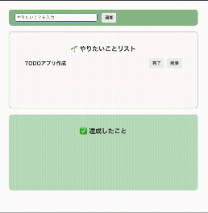

# VanillaJS TODO アプリ

## 目的
1. JavaScript のアウトプット
2. React との違いを理解する（技術進化を体感することが目的）

## デモ

## 使用技術
- HTML
- CSS
- JavaScript (Vanilla JS)

## 実装機能
- TODO の追加
- 削除
- 完了 → 完了リストへ移動
- 戻す → 未完了リストへ戻す

## 開発環境
- StackBlitz を利用

## 参考
Udemy 講座『【React18対応】モダンJavaScriptの基礎から始める挫折しないためのReact入門』（講師：じゃけぇ さん）

## オリジナルの工夫
- HTML / CSS は一から自分で実装
- JSに関しては、教材は兄弟要素のDOM構造を利用して要素を指定していましたが（解説も兼ねて）、オリジナルの工夫として`class` を付与し可読性と保守性を意識しました。

## 学び・改善点
- 実装前の言語化が甘くて詰まった
- 手を動かす前に実装したい処理の言語化をする

## 今後の予定
- React でTODO アプリを作成

## Note
このリポジトリは個人学習用であり、商用利用や完成品の再配布を目的としていません。